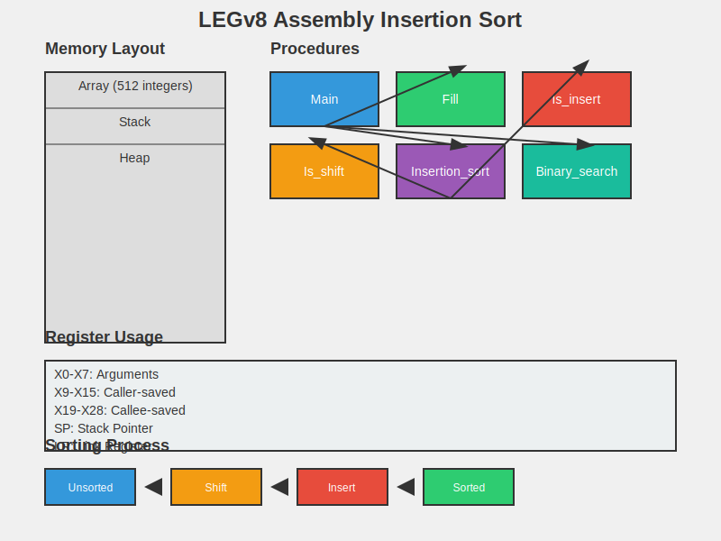

# LEGv8 Assembly Insertion Sort

## Description

This project implements an insertion sort algorithm in LEGv8 assembly language. It demonstrates low-level programming concepts, including array manipulation, procedure calls, and sorting algorithms. The implementation breaks down the insertion sort into smaller procedures to manage complexity and adhere to ARMv8 calling conventions.

## Key Components

1. `main`: Entry point of the program
2. `fill`: Initializes the array with decreasing values
3. `is_insert`: Inserts a value into the array at a specified index
4. `is_shift`: Shifts elements in the array to create space for insertion
5. `insertion_sort`: Implements the insertion sort algorithm
6. `binary_search`: Performs a binary search on the sorted array

## Implementation Details

### Main Procedure
- Allocates an array of 512 64-bit integers
- Calls `fill` to initialize the array
- Calls `insertion_sort` to sort the array
- Performs binary searches for various values and prints the results

### Fill Procedure
- Fills the array with decreasing values from N-1 to 0

### Is_insert Procedure
- Inserts a value into the array at a specified index

### Is_shift Procedure
- Shifts elements in the array to create space for insertion
- Returns the index where the new element should be inserted

### Insertion_sort Procedure
- Implements the insertion sort algorithm using `is_shift` and `is_insert`

### Binary_search Procedure
- Performs a binary search on the sorted array
- Returns the index of the found element or -1 if not found

## ARMv8 Calling Conventions

- All procedures adhere to ARMv8 calling conventions
- Registers X0-X7 are used for passing arguments
- Registers X9-X15 are caller-saved
- Registers X19-X28 are callee-saved
- The stack is used for saving and restoring registers as needed

## Usage

1. Assemble the code using the LEGv8 assembler
2. Run the assembled code on the LEGv8 emulator
3. The program will output:
   - The results of binary searches for the smallest, largest, and middle values
   - A binary search for a value not in the array
4. A core dump will be generated at the end for memory inspection

## Performance Considerations

- Insertion sort has a time complexity of O(n^2)
- The implementation uses minimal memory beyond the array itself
- Binary search has a time complexity of O(log n)

## Future Improvements

1. Implement more efficient sorting algorithms (e.g., quicksort, merge sort)
2. Add input/output functionality for user-defined arrays
3. Optimize register usage for better performance
4. Implement error handling and bounds checking

## Author

Abhay Prasanna Rao
